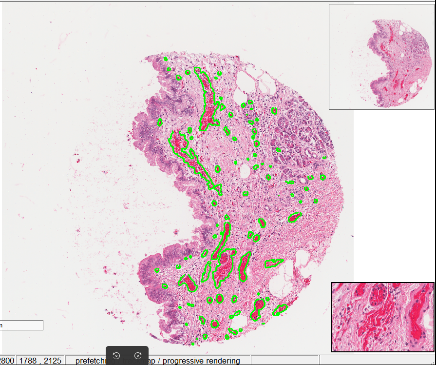

## Hi there 👋

- 🔭 I’m currently working on Generative AI, AI in histopathology and Computer Vision
- 🌱 I’m currently learning MultiGPU Inference for Diffusion models
- 👯 I’m looking to collaborate on interesting related projects
- 📫 How to reach me: afridishere@gmail.com

<table>
  <tr>
    <td style="text-align: center;">
      
<strong>Generative AI</strong>

      
    </td>
    <td style="text-align: center;">
      
<strong>Histopathology</strong>

      
    </td>
    <td style="text-align: center;">
      
<strong>Computer Vision</strong>

      
    </td>
  </tr>
</table>

